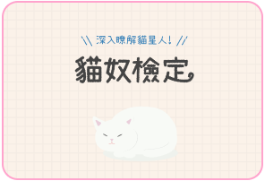
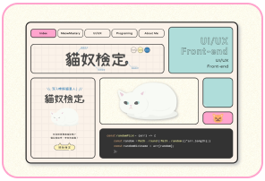
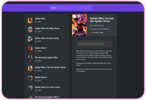

<h1 align="center">I'm Yuki (⁎^◑ᴗ◑^⁎)👍🌟🐈</h1>

<code>#UI/UX</code>  <code>#Front-end</code>  <code>#視覺美感</code>  <code>#邏輯思考</code>

<h4 align="center">你好，我是Yuki!  想成為具設計美感，程式又簡潔易懂的工程師🌟</h4>
<h2>使用技術 <code>-Toolbox-</code></h2>
<h4>⭐Front-end⭐</h4>
<h4> </h4>
<h4>⭐UI/UX⭐</h4>
<h4> </h4>
<h2>專案</h2>
<h3>Projects</h3>
<h4>⭐UI/UX⭐</h4>
<strong>喵起來 - 貓貓咖啡廳預約、認養複合式平台</strong>
<a href="https://www.figma.com/proto/J8XKRJEKz6HrsJuf0KHnMQ/%E8%B2%93%E8%B2%93%E9%A0%90%E7%B4%84%E7%B3%BB%E7%B5%B1?type=design&node-id=48-123&t=1c5EaVfhwJ1qPC0y-1&scaling=scale-down-width&page-id=0%3A1&mode=design">🖼前期發想</a> <a href="https://www.figma.com/proto/J8XKRJEKz6HrsJuf0KHnMQ/%E8%B2%93%E8%B2%93%E9%A0%90%E7%B4%84%E7%B3%BB%E7%B5%B1?type=design&node-id=104-345&t=tx6jUEoOGOnbgkp5-1&scaling=min-zoom&page-id=46%3A11&mode=design">🎨網頁 Layout (製作中)</a>

<h4>⭐Front-end⭐</h4>

<strong>🐈貓奴檢定 - 貓知識測驗小遊戲 <a href="https://meowmastery.netlify.app/">🎮Link</a> <a href="https://github.com/VOxOVb/catquizoxo">🖥Github</a></strong>

<code>#React</code>  <code>#useState</code>  <code>#useEffect</code>  <code>#SCSS</code>

每次遊玩都從題庫隨機取題，以 React 各式 hook 完成進度切換、成績計算及題目解析等功能，並使用 html2canvas 達成測驗結果下載。

<h3></h3>

<strong>🐈貓奴檢定 - 設計發想介紹網頁 <a href="https://meowmastery-intro.netlify.app/">🎮Link</a> <a href="https://github.com/VOxOVb/oxo4work-portfolio">🖥Github</a></strong>

<code>#React</code>  <code>#SCSS</code>  <code>#Rive</code>

介紹貓奴檢定的視覺設計及看不到的程式小巧思，將本來置於 Behance 等平台的平面內容，使用 Rive 及 CSS 加上一個有互動性的登陸頁，並監聽滾動事件，以優化使用者體驗。

|Repo|Intro|
|---|---|
| <strong>🐈貓奴檢定 - 貓知識測驗小遊戲</strong>|<strong><a href="https://meowmastery.netlify.app/">🎮Link</a> <a href="https://github.com/VOxOVb/catquizoxo">🖥Github</a></strong> 
<code>#React</code>  <code>#useState </code>  <code>#useEffect</code>  <code>#SCSS</code>

每次遊玩都從題庫隨機取題，以 React 各式 hook 完成進度切換、成績計算及題目解析等功能，並使用 html2canvas 達成測驗結果下載。
|
| <strong>🐈貓奴檢定 - 設計發想介紹網頁</strong>|<strong><a href="https://meowmastery-intro.netlify.app/">🎮Link</a> <a href="https://github.com/VOxOVb/oxo4work-portfolio">🖥Github</a></strong> 
<code>#React</code>  <code>#SCSS</code>  <code>#Rive</code>

介紹貓奴檢定的視覺設計及看不到的程式小巧思，將本來置於 Behance 等平台的平面內容，使用 Rive 及 CSS 加上一個有互動性的登陸頁，並監聽滾動事件，以優化使用者體驗。
|
| <strong>🎬Usepopcorn - 電影搜尋</strong>|<strong><a href="https://usepopcorn-oxo.netlify.app">🎮Link</a> <a href="https://github.com/VOxOVb/usepopcorn">🖥Github</a></strong> 
<code>#React</code>  <code>#useEffect</code>  <code>#Data fetching</code>  <code>#Custom hooks</code>  <code>#Local storage</code>

搭配線上課程所提供的 CSS ，使用 React 串接電影資訊 api ，供使用者英文輸入搜尋電影，並提供評分電影、加入片單至 Local storage 等功能，且嘗試製作 Custom hooks ，利於工作上與他人共同開發。
|
