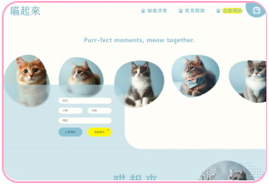

<h1 align="center">I'm Yuki (⁎^◑ᴗ◑^⁎)👍🌟🐈</h1>

<code>#UI/UX</code>  <code>#Front-end</code>  <code>#視覺美感</code>  <code>#邏輯思考</code>

<h4 align="center">你好，我是Yuki!  想成為具設計美感，程式又簡潔易懂的工程師🌟</h4>
<h2>使用技術 <code>-Toolbox-</code></h2>
<h4>⭐Front-end⭐</h4>
<h4> </h4>
<h4>⭐UI/UX⭐</h4>
<h4> </h4>

<h2>學習筆記 <code>-Notes-</code></h2>
<a href="https://hackmd.io/@dZjKIpj2RNCjjxvUEbzBdg/rk0eNbJB1e"><strong>👾Debug December 關卡紀錄</strong></a>
 
<h2>專案 <code>-Projects-</code></h2>

| <h4 align="center">⭐UI/UX⭐</h4>                                                                      |                                                                                                                                                                                                                                                                                                                                                                                                                                                                                                  |
| ------------------------------------------------------------------------------------------------------ | ------------------------------------------------------------------------------------------------------------------------------------------------------------------------------------------------------------------------------------------------------------------------------------------------------------------------------------------------------------------------------------------------------------------------------------------------------------------------------------------------ |
|  <strong>🐈 喵起來 - 貓貓咖啡廳預約、認養複合式平台</strong> | <a href="https://www.figma.com/proto/J8XKRJEKz6HrsJuf0KHnMQ/%E8%B2%93%E8%B2%93%E9%A0%90%E7%B4%84%E7%B3%BB%E7%B5%B1?type=design&node-id=48-123&t=1c5EaVfhwJ1qPC0y-1&scaling=scale-down-width&page-id=0%3A1&mode=design">🖼 前期發想</a> <a href="https://www.figma.com/proto/J8XKRJEKz6HrsJuf0KHnMQ/%E8%B2%93%E8%B2%93%E9%A0%90%E7%B4%84%E7%B3%BB%E7%B5%B1?type=design&node-id=104-345&t=tx6jUEoOGOnbgkp5-1&scaling=min-zoom&page-id=46%3A11&mode=design">🎨 網頁 Layout (製作中)</a> |
| <h4 align="center">⭐Front-end⭐</h4>                                                                  |                                                                                                                                                                                                                                                                                                                                                                                                                                                                                                  |
|  <strong>🐈 貓奴檢定 - 貓知識測驗</strong>             | <strong><a href="https://meowmastery.netlify.app/">🎮Link</a> <a href="https://github.com/VOxOVb/meowmastery">🖥Github</a></strong> 
<code>#React</code>  <code>#Context API</code>

想養貓，光有對貓咪的愛還不夠！想跟喵星人相處融洽，他們的心情與行為、豢養所需物品、身心保健等知識皆不可或缺。透過測驗小遊戲「貓奴檢定」，測試自己是不是稱職的貓奴吧！ 🐾
                                                                                          |
|  <strong>🌍 WorldWise - 旅遊紀錄</strong>                    | <strong><a href="https://github.com/VOxOVb/worldwise">🖥Github</a></strong> 
<code>#React</code>  <code>#React Router</code>  <code>#context API</code>  <code>#memo</code>  <code>#useMemo</code>  <code>useCallback</code>

一個一頁式應用程式(SPA)，結合動態地圖與數據管理功能，用戶可以視覺化並操作地理資訊，適合地理記錄和探索。📌
     |

